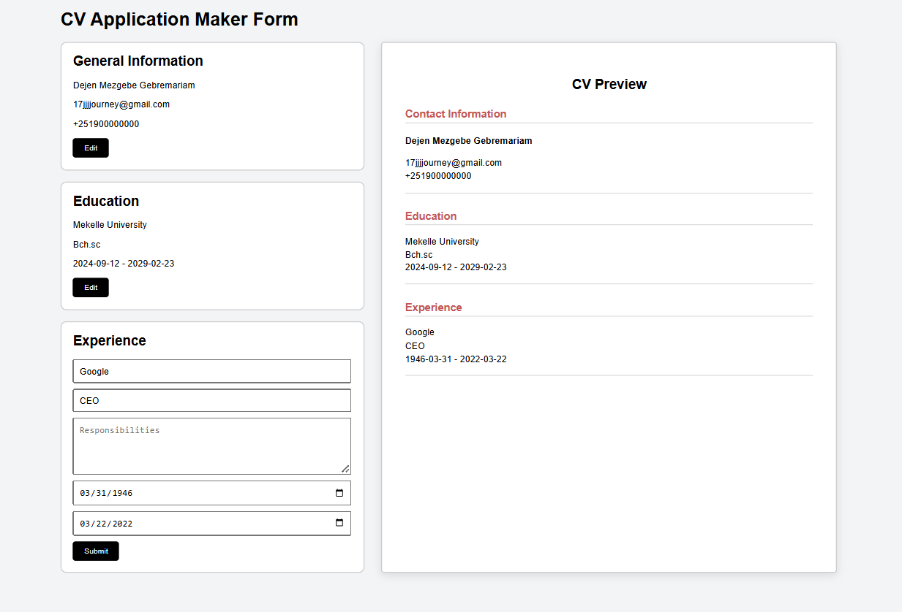

# CV Application

A CV builder application built with React.

## Live Demo

## Built With

- React
- Vite
- JavaScript
- CSS

## Features

- Add personal information
- Add education history
- Add work experience
- Submit and edit information
- Live CV preview
- Responsive layout

## Difficulties

- Understanding how React components communicate with each other.
- Managing form data and updating the CV preview dynamically.
- Learning when to use state and how state updates trigger re-rendering.
- Organizing the project structure to keep components clean and reusable.
- Handling user inputs and making sure the UI updates correctly.
- Making the layout responsive across different screen sizes.

## Project Structure

```text
src/
├── components/
│   ├── Header.jsx
│   ├── GeneralInfo.jsx
│   ├── Education.jsx
│   ├── Experience.jsx
│   └── CVPreview.jsx
│
├── App.jsx
└── main.jsx
```

## Preview



## Getting Started

Clone the repository:

```bash

git clone https://github.com/Fortress-io/AuraX-Summer-2026.git

```

## What I Learned

- How to build applications using React components.
- How JSX works and how it combines JavaScript with HTML-like syntax.
- How to use useState to manage application data.
- How props allow components to share information.
- How to handle form inputs in React.
- How React re-renders the UI when state changes.
- How to create reusable components.
- How to structure a React project for better maintainability.

## What I Can Improve

- Add local storage to save CV information after refreshing the page.
- Add PDF export functionality.
- Improve form validation and error handling.
- Create more reusable form components.
- Add more CV templates with different designs.
- Improve accessibility for better user experience.
- Add animations and better UI interactions.

## Developed By

Dejen Mezgebe (Fortress-io)
