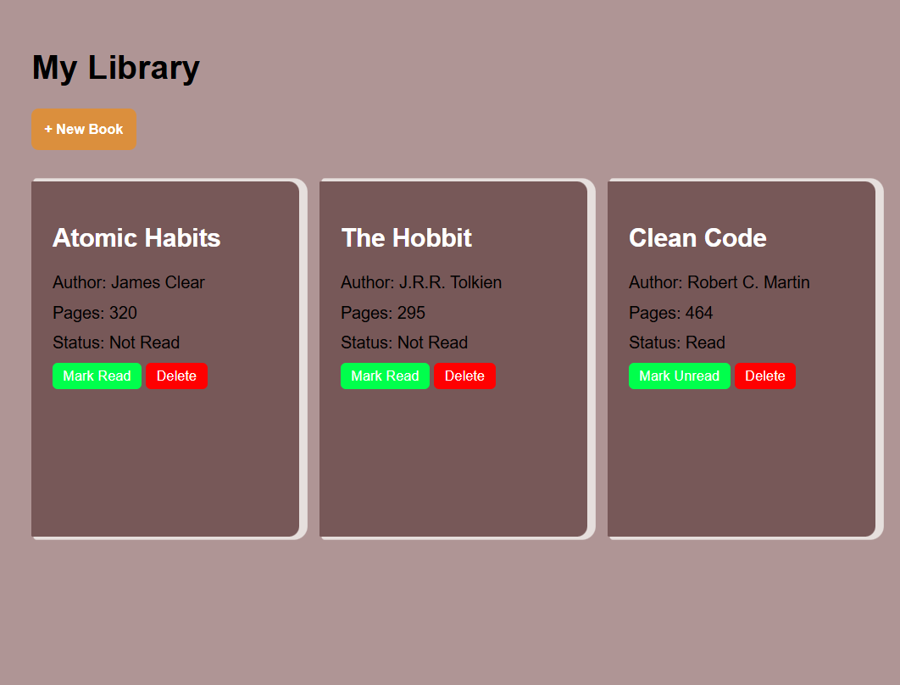

           Library

A simple and interactive Library application built with **HTML**, **CSS**, and **JavaScript** as part of **The Odin Project** Full Stack JavaScript curriculum.

This project demonstrates how to manage application data using JavaScript objects, constructor functions, prototype methods, and DOM manipulation while keeping the data model separate from the user interface.

Live Demo

Coming soon...

Screenshot



Features

- Display books as responsive cards
- Add new books using a dialog form
- Delete books from the library
- Toggle a book's read status
- Unique IDs generated with `crypto.randomUUID()`
- Responsive and modern user interface
- Works across different screen sizes

Built With

- HTML5
- CSS3
- JavaScript (ES6)
- DOM Manipulation
- Constructor Functions
- Prototype Methods
- CSS Grid
- Flexbox
- HTML `<dialog>` Element

What I Learned

While building this project, I practiced:

- Creating objects using constructor functions
- Working with arrays of objects
- Using prototype methods
- Dynamic DOM manipulation
- Event handling
- Form validation
- Preventing default form behavior
- Template literals
- Using `crypto.randomUUID()` for unique identifiers
- Separating application data from UI rendering
- Writing cleaner, reusable JavaScript functions

Project Structure

```
library/
│
├── index.html
├── style.css
├── script.js
├── README.md
└── image.png
```

How It Works

1. Books are stored inside the `myLibrary` array.
2. Each book is created using the `Book` constructor.
3. Every book receives a unique ID using `crypto.randomUUID()`.
4. The `displayBooks()` function renders every book as a card.
5. Users can:
   - Add new books
   - Delete books
   - Toggle the read status
6. After every change, the UI is re-rendered to reflect the current state of the library.

Installation

Clone the repository:

```bash
git clone https://github.com/your-username/library.git
```

Navigate into the project folder:

```bash
cd library
```

Open `index.html` in your browser or use Live Server in VS Code.

Future Improvements

- Save books using Local Storage
- Edit existing books
- Search books
- Sort books by title or author
- Filter by read status
- Mark favorite books
- Add book cover images

Acknowledgements

- [The Odin Project](https://www.theodinproject.com/)
- Inspired by The Odin Project Library assignment.

Author

**Dejen Mezgebe Gebremariam**

- GitHub: https://github.com/Fortress-io

License

This project is licensed under the MIT License.
